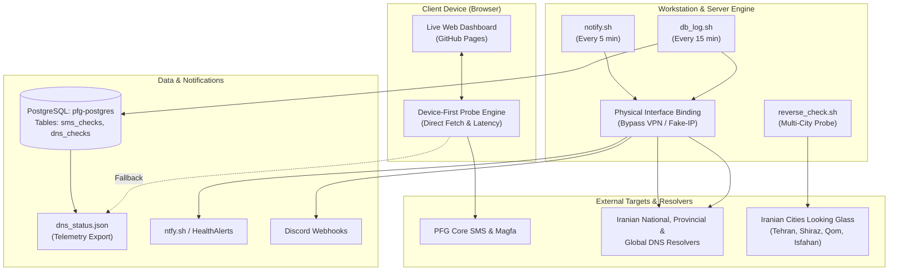

# 📡 PFG SMS Health & DNS Monitor

[](https://ariyasrfz.github.io/pfg-sms-monitor/)
[](https://sms.persiafava.com)
[-blue?style=for-the-badge)](https://time.is/Tehran)

A mission-critical availability, DNS propagation, and multi-ISP visibility monitoring suite built for the **Persia Fava Gostar (PFG)** SMS infrastructure.

---

## 🎯 Vision & Objectives

1. **Uninterrupted SMS Operations**: Continuous monitoring of PFG's core messaging services:
   - **SMS Gateway**: `https://sms.persiafava.com/webservice/rest/`
   - **SMS Web Panel**: `https://sms.persiafava.com/login.php`
   - **Magfa Provider API**: `https://sms.magfa.com/api/http/sms/v2`
2. **National DNS & ISP Resolution Integrity**: Real-time verification that `sms.persiafava.com` consistently maps to `185.49.84.46` across all Iranian telecommunications operators (TCI, MCI, Irancell, Shatel, Asiatech), provincial networks, anti-sanction DNS resolvers (Shecan, Begzar, Electro), and global Anycast resolvers.
3. **Reverse Visibility Probing ("Do They See Us?")**: Active external looking glass probes verifying reachability and DNS resolution from remote nodes situated inside distinct Iranian cities (Tehran, Shiraz, Isfahan, Qom) and autonomous systems (ASNs).
4. **Dual-Engine Telemetry & Device-First Web App**: A client web dashboard that tests endpoints directly on the user's active device instance, seamlessly falling back to server telemetry if the client is offline or sandboxed.

---

## 🏗️ Architecture Overview



---

## 📝 Actions Taken & Engineering History

### 1. Database Schema Initialization & Expansion
- **Database**: PostgreSQL container `pfg-postgres`, Database `pfg_monitor`, User `pfg`.
- **Created Table `dns_checks`**:
  ```sql
  CREATE TABLE IF NOT EXISTS dns_checks (
      id SERIAL PRIMARY KEY,
      checked_at TIMESTAMPTZ NOT NULL DEFAULT now(),
      domain TEXT NOT NULL,
      expected_ip TEXT NOT NULL,
      isp_name TEXT NOT NULL,
      dns_server TEXT NOT NULL,
      resolved_ip TEXT,
      status TEXT NOT NULL,
      message TEXT
  );
  CREATE INDEX IF NOT EXISTS idx_dns_checks_checked_at ON dns_checks (checked_at DESC);
  CREATE INDEX IF NOT EXISTS idx_dns_checks_status ON dns_checks (status);
  ```
- Added `response_time_ms` compatibility column to `sms_checks` to prevent insert warnings.

### 2. DNS Verification in Background Daemons
- Updated [`notify.sh`](notify.sh) to query resolvers across Iran and trigger high-priority alerts on IP mismatches or unexpected timeouts.
- Updated [`db_log.sh`](db_log.sh) to record per-ISP check results and execution metrics into `dns_checks`.

### 3. Root-Cause Analysis: VPN TUN Fake-IP Isolation
- **Problem**: When Clash Verge / Mihomo was running in TUN mode on the monitoring workstation, all UDP port 53 DNS queries were intercepted and returned Mihomo's fake IP (`198.18.0.21`), causing false-alarm alerts across all ISPs.
- **Solution**: Implemented dynamic physical network interface detection (`PHYSICAL_IP=$(ip -4 route show table main default ...)`). All `dig` calls now bind explicitly via `-b "$PHYSICAL_IP"`, bypassing local VPN/TUN proxies and routing directly through the physical network interface (`eno1`).

### 4. Expansion of Iranian Provincial & Public Resolvers
Identified and integrated working Iranian national, provincial, and anti-sanction resolvers:
- **TCI Tehran (Mokhaberat Primary)**: `217.218.155.155`
- **TCI Backup**: `217.218.127.127`
- **TCI Fars (Shiraz Regional)**: `2.189.242.10`
- **MCI Data (Hamrah Aval Datacenter)**: `194.225.62.80`
- **Shecan (Anti-Sanction Tehran)**: `178.22.122.100`
- **Shecan (Anti-Sanction Shiraz/Mashhad)**: `185.51.200.2`
- **Begzar (Anti-Sanction Tabriz/Tehran)**: `185.55.226.26`
- **Electro (Primary & Secondary)**: `78.157.42.101` / `78.157.42.100`
- **Bertina Authoritative NS**: `185.88.152.12`
- **Global Anycast**: Cloudflare (`1.1.1.1`), Google (`8.8.8.8`), Quad9 (`9.9.9.9`), OpenDNS (`208.67.222.222`).

*(Note: Subscriber-only mobile recursors such as `5.200.200.200` and `109.96.8.8` enforce firewall ACLs that reject packets outside their mobile subnets; only mismatch anomalies trigger alerts).*

### 5. Multi-City Reverse Looking Glass Tool
Created [`reverse_check.sh`](reverse_check.sh) to answer: *"Do remote Iranian networks outside our local setup see our server?"*
- Probes remote nodes across Iranian autonomous systems:
  - `ir1` (Tehran - AS47430)
  - `ir3` (Shiraz - AS213953)
  - `ir4` (Shiraz - AS212077)
  - `ir5` (Tehran - AS214431)
  - `ir6` (Qom - AS206596)
  - `ir7` (Tehran - AS213727)
  - `ir8` (Tehran - AS214361)
  - `ir2` (Isfahan - AS209279)
- Confirmed that all external nodes resolve `sms.persiafava.com` to `185.49.84.46`.

### 6. Web Dashboard Redesign (GitHub Pages & `ui-ux-pro-max`)
Refactored [`index.html`](index.html) following strict UI/UX design intelligence:
- **Device-First URL Probing**: Checks endpoints directly from the active client browser first, reporting client-perceived latency (`Probe: This Device Instance`).
- **Seamless Telemetry Fallback**: If the client device is offline or restricted by browser sandbox/CORS, the UI automatically falls back to server-side telemetry from [`dns_status.json`](dns_status.json).
- **Reactive Network Listener**: Real-time detection of client device reconnection or network drops (`Device Online` / `Device Offline`).
- **Optimal Information Hierarchy (Box Reordering)**:
  1. Header & Actions (Theme Toggle, Live Check)
  2. Global KPI Overview Strip (Service Health, DNS Health, Active Device, Target Domain)
  3. Core SMS Endpoints (Cards with HTML5 Canvas sparklines & latency thresholds)
  4. DNS & Iranian ISP Resolution Matrix (Interactive filter tabs & instant search)
  5. Iran Multi-City Reverse Looking Glass (Distributed node table)
  6. Recent Events & Audit Stream (Live chronological timeline)
  7. Settings & Notification Integrations (Bottom collapsible drawer)
- **Vector Iconography**: Replaced all emojis with crisp inline SVG icons (Lucide / Heroicons style).
- **Enterprise Dark Tech Style**: Frosted glass effects, WCAG AA contrast (≥ 4.5:1), and monospace typography for latency and IP metrics.

---

## 📂 Project Structure

| File | Purpose |
| :--- | :--- |
| [`index.html`](index.html) | Live web dashboard deployed to GitHub Pages with Device-First probing. |
| [`notify.sh`](notify.sh) | Cron job (every 5 min): tests services & DNS; sends alerts via ntfy/Discord. |
| [`db_log.sh`](db_log.sh) | Cron job (every 15 min): logs metrics to PostgreSQL and exports `dns_status.json`. |
| [`reverse_check.sh`](reverse_check.sh) | CLI looking glass tool probing remote nodes in Tehran, Shiraz, Isfahan, and Qom. |
| [`dns_status.json`](dns_status.json) | Real-time telemetry payload consumed by the live web dashboard. |
| [`health_check.sh`](health_check.sh) | Standalone console health check script with colored terminal output. |

---

## 🚀 Running & Verification

### Run Manual DNS & Service Notification Check
```bash
/home/aria/projects/pfg-sms-monitor/notify.sh
```

### Run DB Logging & Export Telemetry
```bash
/home/aria/projects/pfg-sms-monitor/db_log.sh
```

### Run Multi-City Looking Glass Reverse Check
```bash
/home/aria/projects/pfg-sms-monitor/reverse_check.sh
```

### Query Database Logs (PostgreSQL)
```bash
docker exec pfg-postgres psql -U pfg -d pfg_monitor -c "
SELECT isp_name, dns_server, resolved_ip, status, message,
       checked_at AT TIME ZONE 'Asia/Tehran' AS checked_at_ir
FROM dns_checks
ORDER BY checked_at DESC
LIMIT 15;
"
```

---

## 🌐 Live Access

- **Web Dashboard**: [https://ariyasrfz.github.io/pfg-sms-monitor/](https://ariyasrfz.github.io/pfg-sms-monitor/)
- **Alert Channel**: [https://ntfy.sh/HealthAlerts](https://ntfy.sh/HealthAlerts)
- **Target Domain**: `sms.persiafava.com` &rarr; `185.49.84.46`
